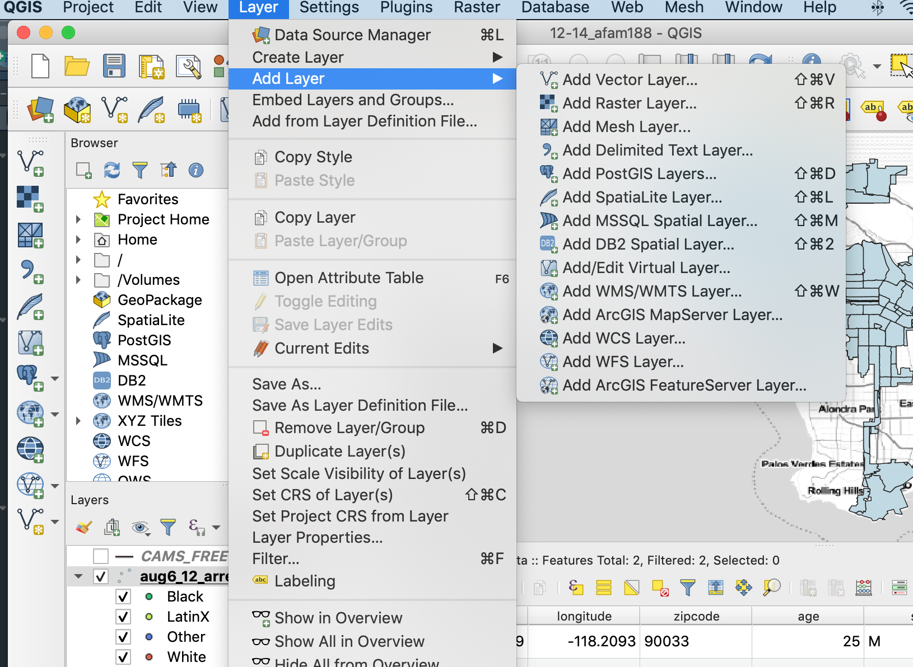
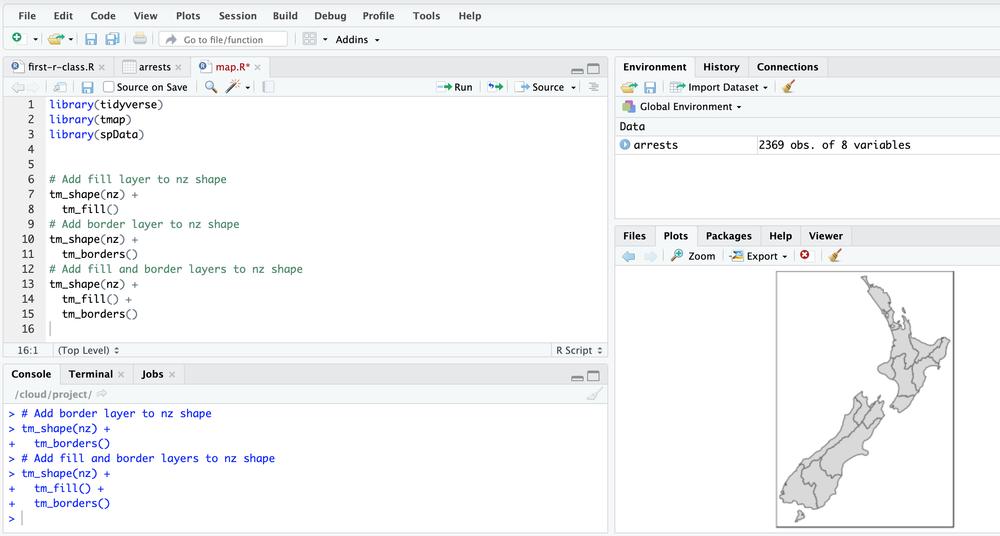
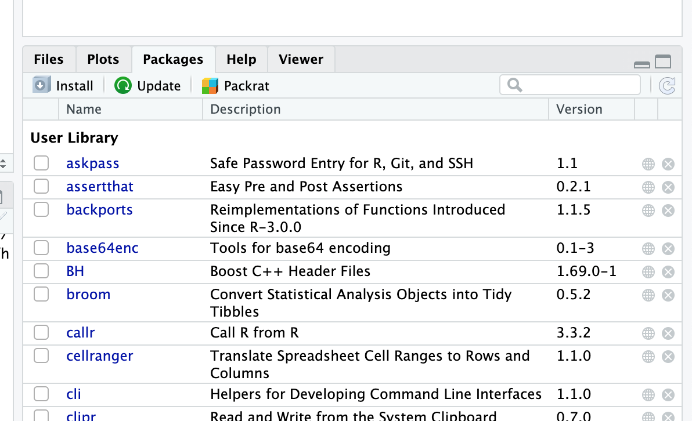
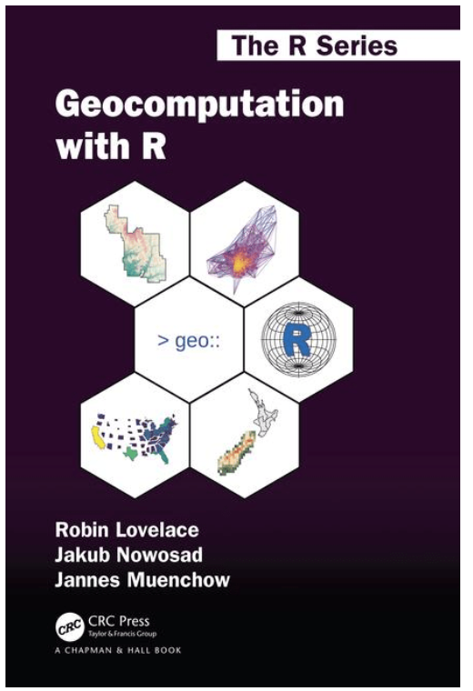
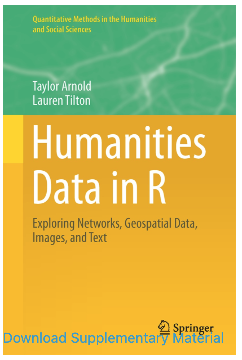

Getting Started with R
========================================================
author: Tim Dennis (Instructor) & Zhiyuan Yao (Helper), Data Science Center
date: 2020-08-05
autosize: true


Today's Learning Objectives
========================================================
* Describe what R and RStudio are and how they are used
* Understand and use each pane in the RStudio IDE
* Locate buttons and options in the RStudio IDE
* Familiarity with running R code
* Know what packages are and how to install and load them
* Understanding how data is represented in R

What are R and RStudio?
========================================================


At its simplest, R is like a car's engine while RStudio is like a car's dashboard

R & RStudio
========================================================

* R is a **programming language** that runs computations
* RStudio is an *integrated development environment (IDE)* that provides an interface by adding many convenient features and tools
* RStudio Cloud provides us access to RStudio & R in the cloud via a web browser

Using R via RStudio
========================================================

Much as we don't drive a car by interacting directly with the engine but rather by interacting with elements on the car's dashboard, we won't be using R directly but rather we will use RStudio's interface.

How do I code in R?
========================================================
* Unlike other statistical software & mapping programs like Excel, SPSS, or QGIS that provide [point-and-click](https://en.wikipedia.org/wiki/Point_and_click) interfaces, R is an [interpreted language](https://en.wikipedia.org/wiki/Interpreted_language)
* This means you have to type in commands written in *R code*.

Menu verses Code
=======================================================

***



Programming concepts and terminology
=====================================================

* There's a lot of terminology in programming and R - we don't expect you to learn all of it now
* The [primers](https://rstudio.cloud/learn/primers) in RStudio Cloud also give you some context to concepts and terms.

Learning to Code
========================================================

>The best way to master these topics is, in our **opinion**, through [deliberate practice](https://jamesclear.com/deliberate-practice-theory) with R and lots of repetition.

Tips on learning to code
=========================================================

* **Remember that computers are not actually that smart**
* **Take the "copy, paste, and tweak" approach**
* **The best way to learn to code is by doing**
* **Practice is key**

R Packages
===========================================================

R packages^1 extend the functionality of R by providing additional functions, data, and documentation. They are written by a worldwide community of R users and can be downloaded for free from the internet. They are essential features of R.


```
[1] "There are 16090 packages available in CRAN as of 2020-08-06"
```


R Packages
==========================================================

A good analogy for R packages is they are like apps you can download onto a mobile phone:


R Packages
==========================================================

* We first install packages to our machine. In RStudio, you'll use the **Packages** menu on the right bottome pane (we'll come back to this).



RStudio Cloud
====================

* You'll need an account to follow along: <https://rstudio.cloud/>
* We'll use a project I've created in RStudio Cloud
* When you access the url, it will create a copy for you
* You won't be messing up my original copy if you edit, so feel free to edit the code

Basic intro to R
=======================

* We'll go to RStudio Cloud and explore the basics of R & RStudio.
* We'll create a R Script and run some some R code.
* We'll learn how to find out how to get help.
* We'll load a dataset.
* Time permitting we'll come back and explore working with text & look at other uses.


TidyText: What is Tidy Data?
=======================

* Each variable is a column
* Each observation is a row
* Each type of observational unit is a table
* **tidy text** format as being a table with one-token-per-row

Source: Julia Silge and David Robinson, Text Mining with R

TidyFlow
===============================


Jane Austin Example
================================

* Back to RStudio Cloud and open `text.R`

Next Steps with Text in R
============================

Look at the [Text Mining with R](https://www.tidytextmining.com/tidytext.html) book for other topics:

* Work with the `gutenbergr` package
* Sentiment analysis
* tf-idf statistic (term frequency times inverse document frequency)
* Topic modeling
* N-grams and word networks

Music Data Source
============================

* SpotifyR - <https://www.rcharlie.com/spotifyr/>
* Taylor Swift R - <https://medium.com/@simranvatsa5/taylor-f656e2a09cc3>
  * Blog on how to use SpotifyR for Taylor Swift by UCLA Alumni

Mapping & Geospatial
======================

* We can use R to do spatial analysis and make pretty maps.
* Let's look at an example in the file `mapping.R` in RStudio Cloud.
* If you need help with Geospatial analysis, contact < [Zhiyuan Yao](https://calendly.com/zyyao/meetwithzhiyuan?month=2020-08)

Geocomputation with R
======================

Link: https://geocompr.robinlovelace.net/




Other Humanities Data Types
============================



Explore for:
=============================

* Network analysis
* Working with images
* Geospatial
* More text

Projects & People Work in R
=============================================

* Jesse Sadler - historian <https://www.jessesadler.com/>
* Simran Vatsa - UCLA Stats & English 19 <https://github.com/simranvatsa?tab=repositories>
* Simran's DH work <https://github.com/simranvatsa/digital-humanities-research>

Getting Help
==================

* Contact the Data Science Center <http://library.ucla.edu/dsc>
* Schedule a meeting with us <http://library.ucla.edu/dsc>
* Notes: <https://docs.google.com/document/d/1h1QaHzXK_ORjfnwu1Vn7AZjqb4Vr7GApD0O5mHjzUNg/edit#>
